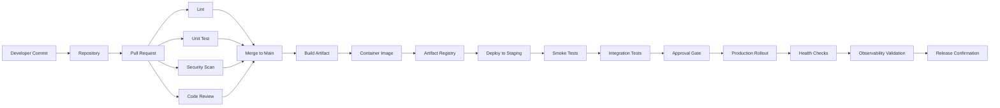
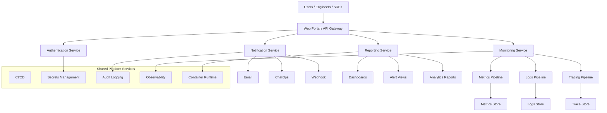

# Vishal Abhinav

  

  

  
  
  
  
  

  
  
  
  
  

## Executive Profile

I am a **Platform Ops Engineer** and **Site Reliability Engineer (SRE)** with a strong **Platform Architect** mindset, focused on designing resilient systems, production-ready platforms, reliable delivery pipelines, and observability-first operations.

My work combines:

- System design for scale, resilience, and operational simplicity
- DevOps execution for CI/CD, automation, release safety, and infrastructure workflows
- Platform architecture for reusable engineering foundations
- SRE practices for availability, reliability, incident readiness, and service health
- Monitoring and observability for measurable production confidence
- Cloud and multicloud strategy for adaptable infrastructure decisions

This repository acts as a **professional engineering portfolio** for:

- **Platform Ops Newsletter**
- **Ops Core App Monitoring Tool Building**
- Architecture and DevOps reference material
- Platform engineering patterns
- Open source contribution visibility
- Technical leadership positioning

## Role and Focus

**Role:** Platform Ops Engineer / SRE  
**Focus:** Platform Architect

### Primary Engineering Identity

- Platform Ops Engineer
- Site Reliability Engineer
- Platform Architect
- DevOps Engineer
- System Design Practitioner
- Monitoring and Observability Builder

## Professional Summary

I build platforms and operational systems that help engineering teams move faster without compromising stability. My approach is rooted in production thinking: release safety, service resilience, operational visibility, automation, and architectural clarity.

I am especially interested in:

- Building scalable internal platform capabilities
- Standardizing deployment and runtime workflows
- Enabling observable-by-default systems
- Strengthening repository and pull request quality
- Improving monitoring, alerting, and operational feedback loops
- Designing cloud-aware and multicloud-ready engineering patterns

## Core Strengths

- Platform operations
- Site reliability engineering
- System design
- DevOps automation
- CI/CD pipeline architecture
- Observability engineering
- Infrastructure standardization
- Release governance
- Incident readiness
- Cloud operations

## Technology Stack

### Languages

  
  
  
  
  

### Operating Systems

  
  
  

### Cloud and Infrastructure

  
  
  
  
  
  

### DevOps, Automation, and Delivery

  
  
  
  
  
  

### Containers and Runtime

  
  
  

### Monitoring, Reliability, and Observability

  
  
  
  
  
  

### Collaboration and Engineering Workflow

  
  
  
  
  

## Engineering Philosophy

I optimize for production-grade outcomes, not only successful deployments. That means every system should be designed with visibility, failure handling, repeatability, and operational ownership in mind.

### What this means in practice

- Services should be observable from day one
- Deployments should be automated, testable, and reversible
- Platform standards should reduce cognitive load for developers
- Monitoring should help teams act, not just collect data
- Pull requests should improve quality, traceability, and collaboration
- Architecture decisions should scale with both traffic and team size

## Engineering Themes

### System Design

- High-availability system planning
- Clear service boundaries and integration contracts
- Queue-based and event-driven decoupling patterns
- Stateless compute where appropriate
- Cache, throughput, and latency awareness
- Fault isolation and graceful degradation
- Security-conscious access design
- Capacity and performance planning

### Platform Architecture

- Shared engineering foundations
- Reusable deployment templates
- Golden path workflows for developers
- Standardized environment and runtime patterns
- Scalable internal tooling strategy
- Architecture alignment across teams and services

### SRE and Reliability

- SLO-oriented thinking
- Alert quality improvement
- Incident response readiness
- Monitoring and dashboard coverage
- Error budget awareness
- Health checks, synthetic checks, and post-release validation

### DevOps and Delivery

- CI/CD pipeline architecture
- Infrastructure as code
- Artifact lifecycle management
- Security scanning in delivery flow
- Release confidence through gates and automation
- Rollback-aware deployment models

## CI/CD Pipeline Approach

### Pipeline Goals

- Faster but safer delivery
- Clear release quality gates
- Lower deployment risk
- Better auditability
- Observable production rollouts

## Platform Monitoring System Design

## DevOps and SRE Operating Model

1. Developers build and push code through a repository-driven workflow.
2. Pull requests trigger automated checks for quality, security, and correctness.
3. Approved changes are merged and transformed into versioned artifacts.
4. Staging deployments validate runtime behavior before production rollout.
5. Production deployments use controlled strategies and post-release health checks.
6. Dashboards, logs, traces, and alerts confirm service behavior in real time.
7. SRE practices guide incident detection, response quality, and service reliability improvement.

## Pull Request and Repository Excellence

I value engineering workflows that scale well across teams:

- Small and reviewable pull requests
- Clear repository structure
- Automated validation before merge
- Traceable release behavior
- Documentation paired with implementation
- Infrastructure changes reviewed with the same rigor as application code

## Profile Metrics

  
  

  

### Pull Request and Contribution Visibility

The profile cards above surface public GitHub activity, languages, and overall contribution patterns.

## Repositories

Below are repository-wise cards for your public projects using the exact repository names you shared.

### Portfolio and Platform Repositories

### Open Source and Forked Contributions

### Development and Learning Repositories

### Repository Highlights

- `the_vishalabhinav`: portfolio hosting repository
- `Platform-ops-Newsletter`: newsletter and platform-ops focused project space
- `DevOps-AI-Agent`: DevOps and AI-oriented repository direction
- `node-mysql2`: forked open source contribution in the Node.js ecosystem
- `DevOps-Interview-Questions` and `devops-interview-questions-1`: DevOps interview preparation and knowledge sharing
- `vishal-abhinav-ai`: GitHub profile configuration repository

## Open Source Contribution

I am interested in contributing to the broader engineering ecosystem through:

- Pull request contributions
- Platform and DevOps tooling improvements
- Monitoring and observability projects
- Documentation and architecture improvements
- Community-driven engineering collaboration

## Certifications and Strategic Direction

- **AI Certified**
- **OCI Certified**
- **Multicloud Strategy**
- Continuous learning across cloud, platform operations, DevOps, and reliability engineering

## Product Vision

### Platform Ops Newsletter

A technical knowledge initiative for:

- Platform engineering insights
- DevOps maturity models
- Monitoring strategy
- SRE practices
- Architecture guidance
- Operational excellence patterns

### Ops Core App Monitoring Tool Building

A product direction focused on:

- Centralized application monitoring
- Metrics, logs, and traces correlation
- Alert intelligence and service visibility
- Reliability engineering workflows
- Operations dashboards and reporting
- Scalable platform observability

## Connect

- GitHub: [Vishal-Abhinav](https://github.com/Vishal-Abhinav)
- LinkedIn: [Vishal Abhinav](https://www.linkedin.com/in/vishal-abhinav/)

## Collaboration

I am open to collaborating on:

- Platform engineering initiatives
- SRE and observability programs
- DevOps transformation
- System design reviews
- Cloud and multicloud operating models
- Open source infrastructure and automation work
