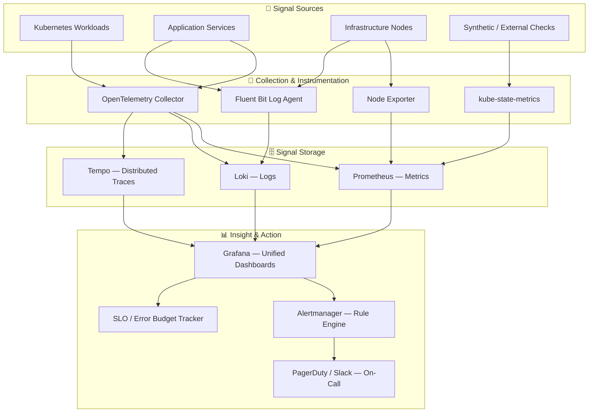
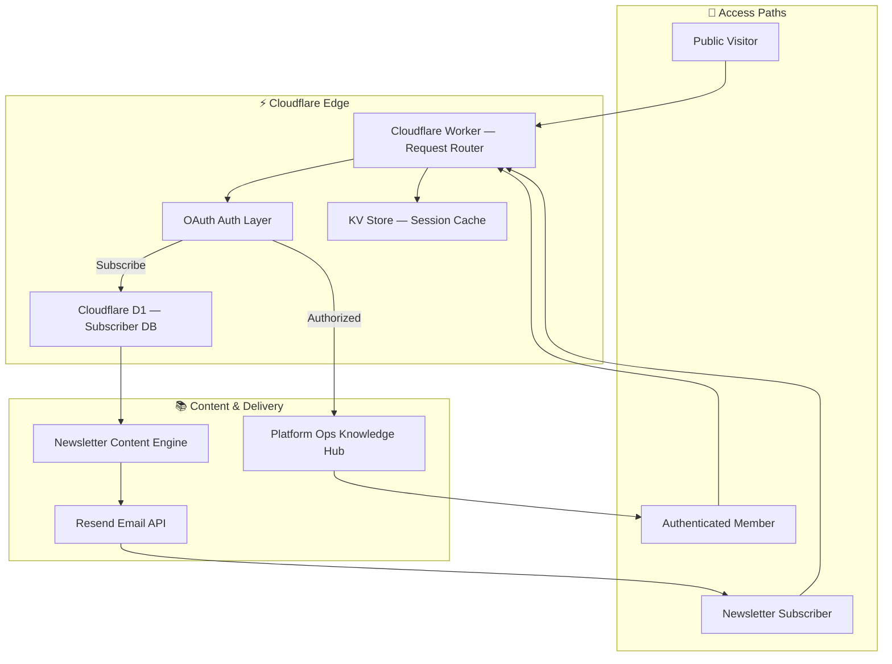
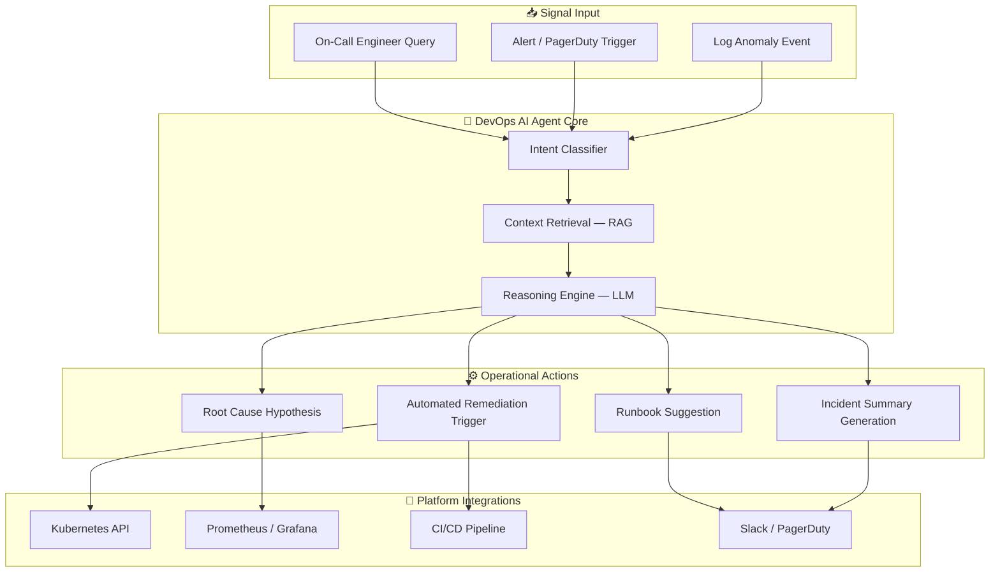
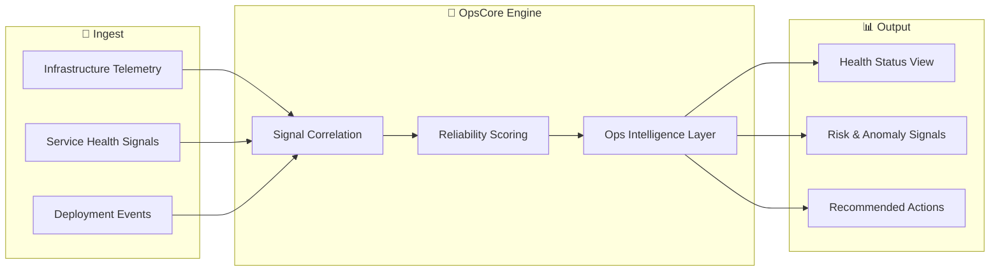

<div align="center">


<a href="https://github.com/Vishal-Abhinav">
  
</a>

<br/><br/>

[](https://www.linkedin.com/in/vishal-abhinav)
[](https://github.com/Vishal-Abhinav)
[](https://platformops.srivantechnologies.com/)
[](https://srivantechnologies.com/)

[](https://github.com/Vishal-Abhinav)
[](https://github.com/Vishal-Abhinav?tab=followers)

</div>

---

## 👋 Who I Am

I'm **Vishal Abhinav** — a Platform and DevOps engineer who has built a career around one belief: **production is the only environment that matters.**

Most engineers ship features. I build the systems that make shipping safe — the delivery pipelines, the observability layers, the reliability frameworks, and the platform foundations that let teams move fast without breaking things at 3 AM.

My work lives at the intersection of **infrastructure and product thinking**. I don't just configure Kubernetes clusters — I design how workloads land, scale, fail gracefully, and recover. I don't just set up Grafana dashboards — I engineer what the system tells us about itself before an incident becomes an outage.

What drives me day to day:

- Turning **operational chaos into observable, automatable systems**
- Building **CI/CD pipelines** that engineers trust because they've never failed them in production
- Designing **platform layers** that make the right way the easy way for development teams
- Bringing **AI into DevOps workflows** — not as a gimmick, but as a real force multiplier for on-call engineers and platform teams

I've taken these principles and applied them to real products. **Platform Ops** is a production-grade engineering knowledge platform I built and deployed on Cloudflare Workers with OAuth, a newsletter engine, and structured content for platform and SRE engineers. **DevOps AI Agent** is my experiment at bringing operational intelligence into engineering workflows. And **OpsCore** is where I'm heading next — an observability product built for teams who are tired of alert noise and blind spots.

```yaml
identity:
  name:        "Vishal Abhinav"
  role:        ["Platform Engineer", "DevOps Engineer", "SRE", "Cloud-Native Engineer"]
  builds:      ["Platform Ops", "DevOps AI Agent", "OpsCore"]
  core_stack:  ["Kubernetes", "OpenShift", "CI/CD", "GitOps", "Prometheus", "Linux"]
  principle:   "Observable by design. Automatable by default. Recoverable under pressure."
```

---

## ⚡ At a Glance

| | |
|:---|:---|
| 🧭 **Engineering Identity** | Platform Engineer · DevOps · SRE · Cloud-Native |
| 🛠️ **Primary Stack** | Kubernetes · OpenShift · CI/CD · GitOps · Observability · Linux |
| 🚀 **Built & Shipped** | [Platform Ops](https://platformops.srivantechnologies.com/) — production-deployed engineering platform on Cloudflare edge |
| 🤖 **Experimenting** | [DevOps AI Agent](https://github.com/Vishal-Abhinav/DevOps-AI-Agent) — AI-powered operational intelligence |
| 🧭 **Building Next** | OpsCore — observability & ops-intelligence product for SRE/platform teams |
| 🔭 **Interested In** | Platform Eng · DevOps · SRE roles at product-first, engineering-driven companies |

---

## 🛠️ Tech Stack

<div align="center">

**Orchestration & Platform**


**CI/CD & GitOps**


**Cloud & Infrastructure**


**Observability**


**Languages & Scripting**


**OS & Runtime**


</div>

---

## 🏗️ Architecture Case Studies

> Real architecture patterns from the systems I build and operate. Designed for production: observable, recoverable, automatable.

---

### Case Study 1 — Zero-Downtime Kubernetes Delivery Pipeline

**Problem:** Manual deployments with no rollback strategy, inconsistent environments, and no post-release validation. Every deployment was a risk event.

**Approach:** GitOps-driven delivery with automated quality gates, staged rollout, and observability validation baked into the pipeline — not bolted on after.

```mermaid
flowchart LR
    subgraph Dev["👨‍💻 Development"]
        A[Feature Branch] --> B[Pull Request]
        B --> C[Code Review + CI Gates]
    end
    subgraph Build["🔨 Build & Validate"]
        C --> D[GitHub Actions Trigger]
        D --> E[Lint + Unit Tests]
        D --> F[SAST Security Scan]
        E --> G[Docker Build]
        F --> G
        G --> H[Container Registry]
    end
    subgraph Deploy["🚀 GitOps Deploy"]
        H --> I[Helm Values Update]
        I --> J[ArgoCD Sync]
        J --> K[Staging Namespace]
        K --> L[Smoke + Integration Tests]
        L --> M{Gate Pass?}
        M -- Yes --> N[Production Rollout]
        M -- No --> O[Auto Rollback]
    end
    subgraph Observe["📊 Post-Deploy Observe"]
        N --> P[Prometheus Metrics]
        N --> Q[Loki Log Streams]
        P --> R[Grafana Dashboards]
        Q --> R
        R --> S[Alertmanager]
        S --> T[On-Call Alert]
    end
```



**Outcome:** Deployment confidence through automation, zero-touch rollback, and live observability validation before marking a release healthy.

---

### Case Study 2 — Full-Stack Observability Architecture (Metrics · Logs · Traces)

**Problem:** Production systems running blind — no correlation between metrics spikes, log errors, and trace slowdowns. Incidents were reactive and slow to diagnose.

**Approach:** Three-pillar observability with a unified collection layer, correlated storage backends, and a single Grafana pane of glass for actionable insight.



**Outcome:** Engineers diagnose incidents from a single correlated view — a metric spike links directly to the offending log stream and the trace that proves where latency originates.

---

### Case Study 3 — Platform Ops: Edge-Native Engineering Knowledge Platform

**Problem:** Engineering knowledge is scattered across docs, Slack threads, and tribal memory. No structured, access-controlled platform to deliver operational knowledge to platform teams at scale.

**Approach:** A serverless-first, globally distributed platform on Cloudflare edge with OAuth authentication, a D1 relational store, and an automated newsletter delivery pipeline.



**Stack:** Cloudflare Workers · Cloudflare D1 · OAuth · Resend · Edge KV

**Live →** [platformops.srivantechnologies.com](https://platformops.srivantechnologies.com/) &nbsp;|&nbsp; **Repo →** [Platform-ops-Newsletter](https://github.com/Vishal-Abhinav/Platform-ops-Newsletter)

---

### Case Study 4 — DevOps AI Agent: Operational Intelligence Layer

**Problem:** On-call engineers spend too much time in runbooks, searching logs, and manually triaging alerts — cognitive load that slows incident response.

**Approach:** An AI agent that understands operational context — classifying intent, correlating signals, suggesting runbooks, and triggering remediation — reducing time-to-resolution.



**Repo →** [DevOps-AI-Agent](https://github.com/Vishal-Abhinav/DevOps-AI-Agent)

---

### 🧭 OpsCore — Product Direction

An upcoming observability and operations-intelligence product for platform, DevOps, infrastructure, and SRE teams. Built to reduce alert noise, surface actionable health signals, and give teams operational clarity — not just more dashboards.



> Part of [Srivan Technologies](https://srivantechnologies.com/) engineering product direction.

---

## 📊 GitHub Analytics

<div align="center">

<!-- Row 1: Stats + Top Languages -->


<br/><br/>

<!-- Row 2: Profile Summary Cards — 4 cards -->


<br/><br/>

<!-- Row 3: Profile Details (full width) -->


<br/><br/>

<!-- Row 4: Streak Stats — using herokuapp (more stable) -->


<br/><br/>

<!-- Row 5: Activity Graph -->


<br/><br/>

<!-- Row 6: Trophies -->


</div>

---

## 🐍 Contribution Snake

<div align="center">

<picture>
  <source media="(prefers-color-scheme: dark)"
    srcset="https://raw.githubusercontent.com/Vishal-Abhinav/Vishal-Abhinav/output/github-contribution-grid-snake-dark.svg" />
  <source media="(prefers-color-scheme: light)"
    srcset="https://raw.githubusercontent.com/Vishal-Abhinav/Vishal-Abhinav/output/github-contribution-grid-snake.svg" />
  
</picture>

</div>

> ⚙️ Auto-generated daily via `.github/workflows/snake.yml`. To activate: push `snake.yml`, then go to **Actions → Generate Contribution Snake → Run workflow**.

---

## 🔭 Engineering Interests

- Cloud-native platform architecture and internal developer platforms
- AI-assisted operations, incident intelligence, and log analysis
- GitOps-driven delivery and progressive deployment strategies
- Observability-first design: metrics, logs, traces as first-class citizens
- SRE practices: SLOs, error budgets, incident readiness, and MTTR reduction

---

## 🧠 Knowledge Areas

<table>
<tr>
<td valign="top" width="33%">

**Platform & Orchestration**
- Kubernetes cluster operations
- OpenShift workload management
- Helm chart design and lifecycle
- Container image and registry patterns

</td>
<td valign="top" width="33%">

**Delivery & Automation**
- CI/CD pipeline architecture
- GitOps workflows with ArgoCD
- Infrastructure as code (Terraform)
- Release governance and rollback design

</td>
<td valign="top" width="33%">

**Reliability & Observability**
- Prometheus + Grafana stack
- OpenTelemetry instrumentation
- SLO/SLA design, error budgets
- Incident response and MTTR reduction

</td>
</tr>
</table>

---

## 📬 Connect

<div align="center">

[](https://www.linkedin.com/in/vishal-abhinav)
[](https://platformops.srivantechnologies.com/)
[](https://github.com/Vishal-Abhinav?tab=repositories)
[](https://srivantechnologies.com/)

<br/>


</div>
